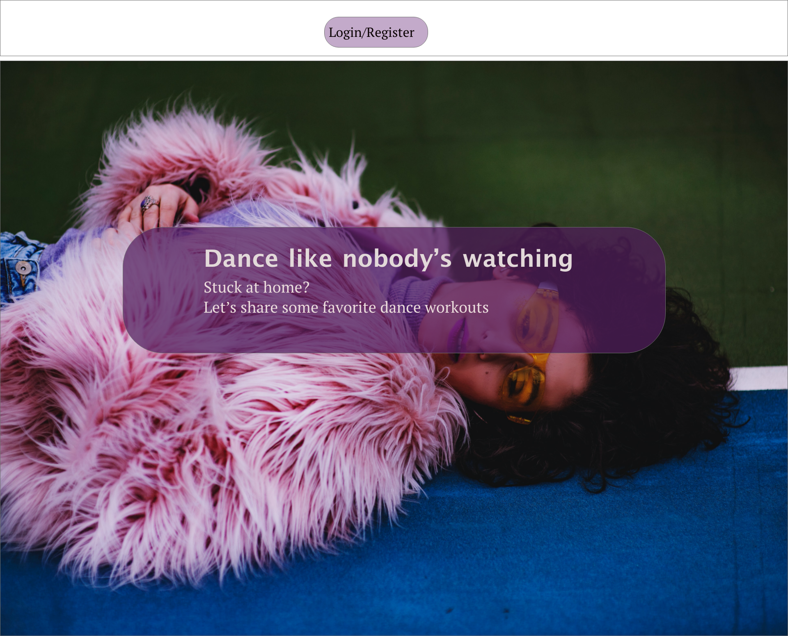
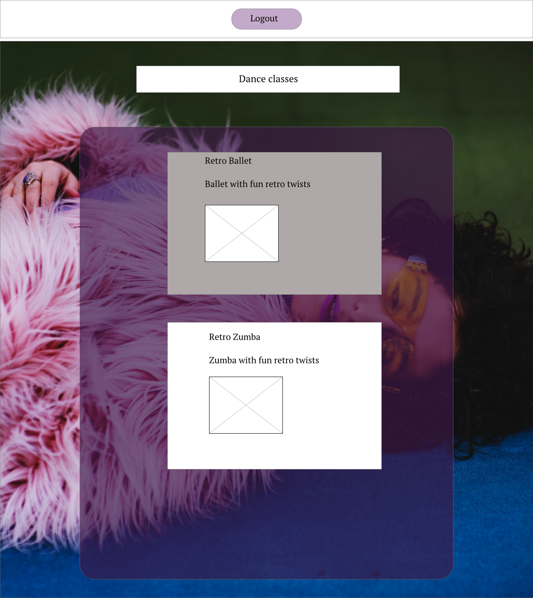
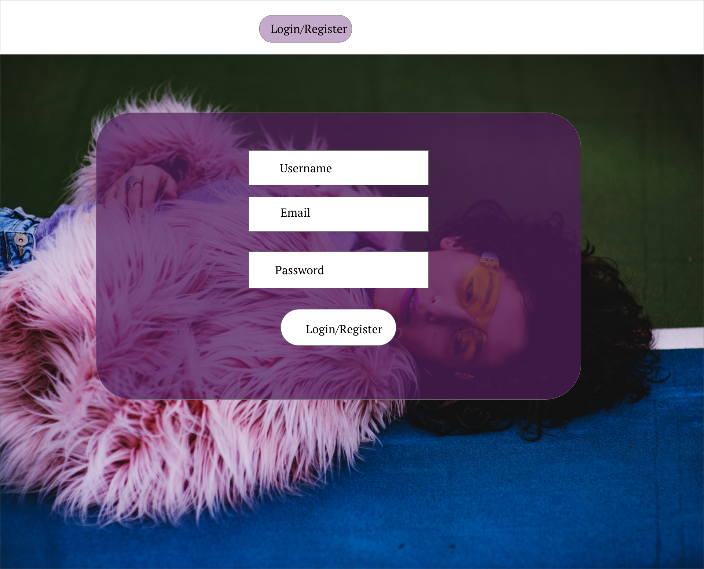
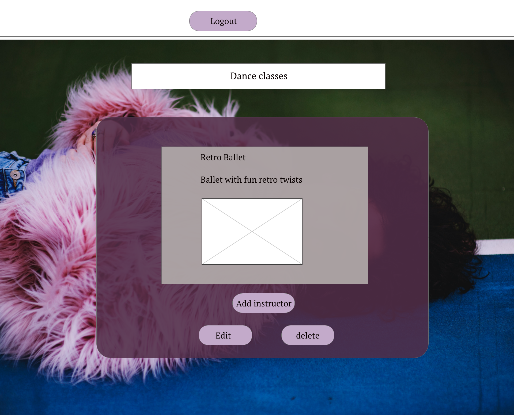
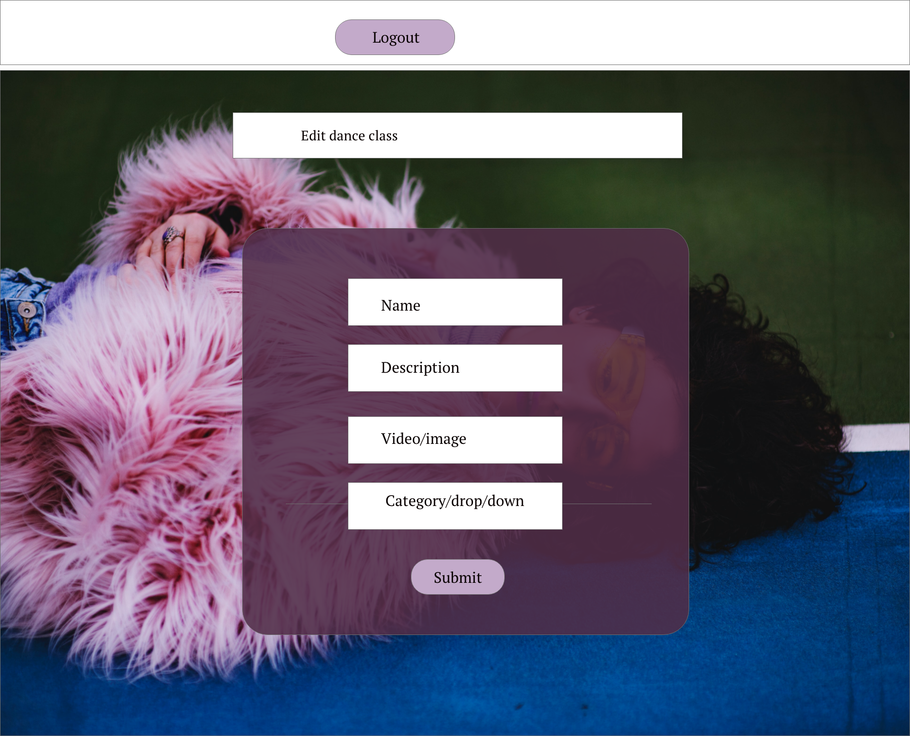

# dance-studio-app


- [Overview](#Overview)
  - [Core Features](#Core-Features)
  - [Goals](#Goals)
  - [Team](#Team)
  - [Permissions](#Permissions)
- [MVP](#MVP)
  - [Client (Front End)](#Client-Front-End)
    - [Wireframes](#Wireframes)
    - [Component Hierarchy](#Component-Hierarchy)
    - [Component Breakdown](#Component-Breakdown)
    - [Component Estimates](#Component-Estimates)
  - [Server (Back End)](#Server-Back-End)
    - [ERD Model](#ERD-Model)
    - [Data Heirarchy](#Data-Heirarchy)
    - [Data Heirarchy](#Data-Heirarchy-1)
  - [Dependencies](#Dependencies)
- [Post-MVP](#Post-MVP)
- [Code Showcase](#Code-Showcase)
- [Code Issues & Resolutions](#Code-Issues--Resolutions)

<br>

## Overview

-_Content management system for dance studio_


### Core Features

- _Full-stack, full-CRUD app, utilizing a RESTful JSON API with the so-called "React on Rails" stack_

### Technology

-  **RESTful JSON API**.
- Back End **Ruby on Rails** server, exposing RESTful JSON endpoints.
- Postgresql database with tables:

  - 1 user table
  - 1 category table
  - 1 dance classes table
  - 2 pairs of associated tables. 
  - Used **Rails** to define models for interacting with the database.
  - Authentication using **JWT**.
  - Working generic controller actions for full-CRUD (`index`, `show`, `create`, `update`, `delete`) between the 2 non-user tables AND partial-CRUD (`create`, at least) for the user table.

- Front End:  **React** app, built using `npx create-react-app`.
- Consume data from your **Ruby on Rails API**, and render that data in your components.
- **React Router**, for client-side routing.
- Authentication, permitting the user to:
  - Register, login, and send authenticated requests.
  - Perform `index` or `show` actions, **whether or not they are logged in**.^
  - Perform `create`, `update`, and `delete` actions **when logged in**.

### Permissions

Digital assets used with full licensing and permission from [Unsplash](). Digital assets stored locally and on [Imgur]().

<br>

## MVP

#### Wireframes

> Use the Wireframes section to display desktop, tablet and mobile views.

- Desktop Landing



- Classes list



- login/register



- one dance



- edit



- create


#### Component Hierarchy

> Use this section to define your React components and the data architecture of your app.

```structure

src
|__ assets/
      |__ fonts
      |__ graphics
      |__ images
      |__ mockups
|__ client/
  |__ App.jsx
  |__ Index.jsx
  |__ src/
    |__ components/
        |__ Header.jsx
        |__ Main.jsx
          |__ Hero.jsx
          |__ Login.jsx
          |__ Register.jsx
          |__ DanceList.jsx
            |__ DanceDetails.jsx
            |__ CreateItem.jsx
              |__ EditItem.jsx
              |__ DeleteItem.jsx
|__ services/
    |__ apiConfig.jsx
```

### Server (Back End)

#### ERD Model


#### Data Heirarchy

> Use this section to display the database, table, and attribute heirarchy.

```structure

database_db
|__ users/
|__ category/
|__ classes/

```

#### Data Heirarchy

> Use this section to display the expected endpoints from your API.

<br>

### Dependencies

|    Library    |
| :-----------: |
|     React     |
| React Router  |
|     axios     |
| ruby on rails |

<br>

---

